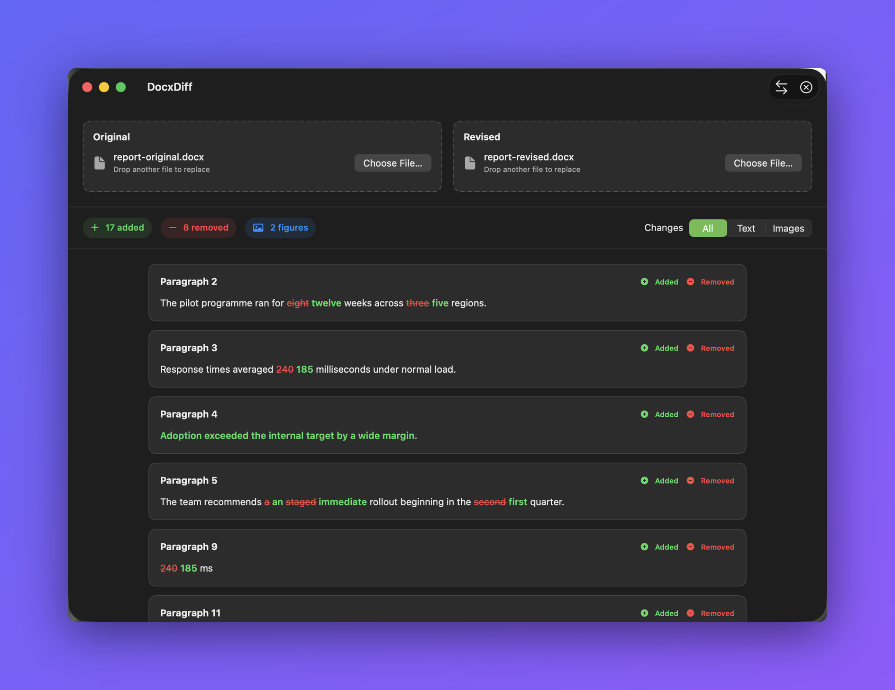

# DocxDiff

Compare two DOCX files on your Mac and see exactly which words and embedded images changed.



## Download

**[⬇︎ Download for macOS](https://github.com/Alyetama/DocxDiff/releases/latest/download/DocxDiff.dmg)**

That link always points at the newest release, because the DMG filename carries no
version — see [Releases](https://github.com/Alyetama/DocxDiff/releases) for the changelog.

Requires macOS 14 or later.

## Features

- **Word-level text diffs.** Paragraphs and table cells are aligned in document order, with removed words struck through in red and added words in green.
- **Embedded image comparison.** Figures whose bytes were added, removed, or replaced are reported; a replacement keeps both the old and new preview side by side.
- **Drag and drop, or pick a file.** Drop a DOCX onto either slot or click to browse. Comparison starts on its own once both slots hold a valid document.
- **Filter what you look at.** Switch between All, Text, and Images to narrow the result list.
- **Swap and clear.** Reverse which file counts as the baseline, or reset both slots, without relaunching.
- **Nothing leaves your Mac.** No uploads, no accounts, no database. Temporary extraction directories are deleted after each comparison, failure, or cancellation.

## Scope

DocxDiff does not compare text formatting; image size, crop, position, or style when the
media bytes are unchanged; headers; footers; comments; footnotes; endnotes; or
tracked-change metadata. It does not export reports, and the bundle is neither App Store
sandboxed nor notarized.

## First launch (opening an unsigned app)

**DocxDiff isn't signed with an Apple Developer ID**, so macOS blocks it the
first time you open it. This is expected — you only need to do one of the
following once, and it opens normally afterward.

**1. Right-click to open.** In Finder, **Control-click** (or right-click)
`DocxDiff`, choose **Open**, then click **Open** again in the dialog.

**2. If macOS still won't let you (newer versions):** open
**System Settings → Privacy & Security**, scroll down to the message about
`DocxDiff` being blocked, and click **Open Anyway**. Confirm with
**Open Anyway** (and Touch ID or your password if asked).

**3. Terminal fallback.** If neither works, remove the quarantine flag and open
it normally:

```bash
/usr/bin/xattr -dr com.apple.quarantine /Applications/DocxDiff.app
```

(Adjust the path if you keep the app somewhere other than `/Applications`.)

## Build from source

Needs macOS 14 or later and a Swift 5.10-compatible toolchain.

```bash
git clone https://github.com/Alyetama/DocxDiff.git
cd DocxDiff
swift build
swift test
```

To build the app bundle and launch it:

```bash
./script/build_and_run.sh
```

The staged bundle lands in `dist/DocxDiff.app`.

## License

[MIT](LICENSE) © 2026 Alyetama
